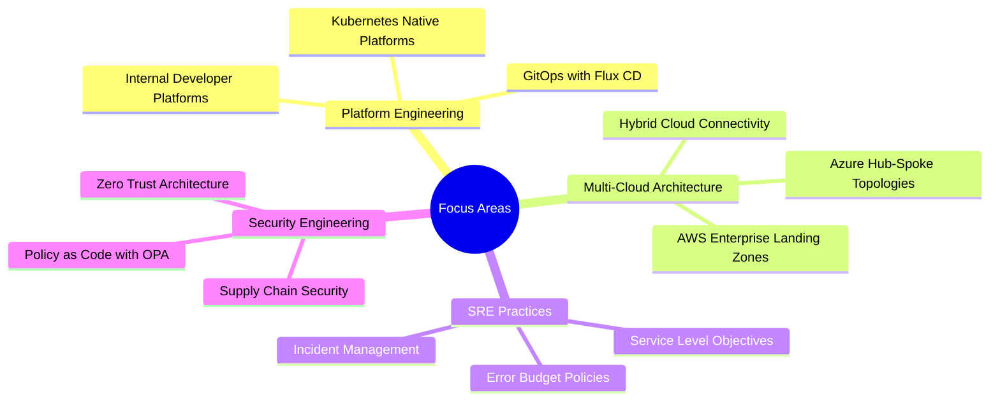
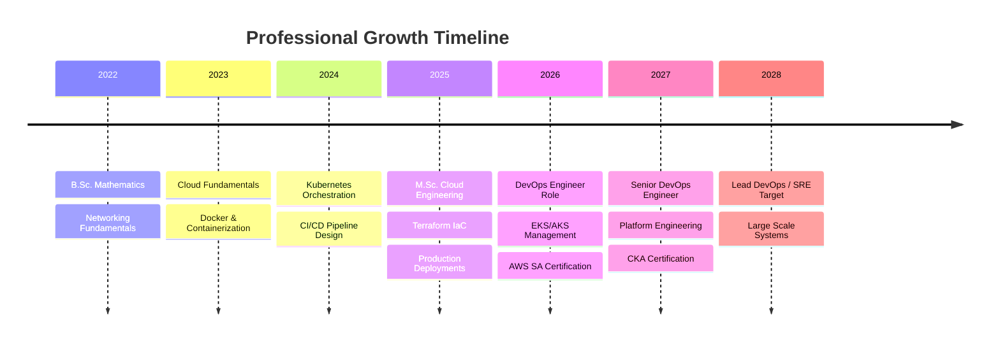

<div align="center">

<!-- Animated Typing Header -->
<a href="https://git.io/typing-svg">
  
</a>

<!-- Professional Banner -->


<!-- Social Badges -->
<p align="center">
  <a href="https://linkedin.com/in/balvant-vishwakarma-5a2447323" target="_blank">
    
  </a>
  <a href="https://balwantvishwakarma.me" target="_blank">
    
  </a>
  <a href="mailto:balwantvishwakarma302@gmail.com" target="_blank">
    
  </a>
  <a href="https://github.com/balvantvishwakarma" target="_blank">
    
  </a>
</p>

<!-- Visitor Counter & Profile Views -->
<p align="center">
  
  
  
</p>

</div>

---

##  About Me

> **Enterprise DevOps Engineer** specializing in cloud-native infrastructure, platform automation, and site reliability engineering. I architect production-grade systems that scale, automate complex deployment pipelines, and build resilient infrastructure across AWS and Azure ecosystems.

<pre align="center">
┌─────────────────────────────────────────────────────────────────┐
│  <b>Name:</b>     Balvant Vishwakarma...                                  │
│  <b>Role:</b>     DevOps Engineer & Cloud Architect                     │
│  <b>Company:</b>  BaseSolve Informatics Private Limited                  │
│  <b>Location:</b> Ahmedabad, Gujarat, India                              │
│  <b>Education:</b> M.Sc. IMS & Cloud Engineering (2025)                  │
│  <b>Focus:</b>    Kubernetes · Terraform · AWS · Azure · CI/CD          │
│  <b>Motto:</b>    "Infrastructure as Code. Automation by Design."       │
└─────────────────────────────────────────────────────────────────┘
</pre>

---

## 🎯 Professional Summary

Results-driven **DevOps Engineer** with hands-on expertise in cloud infrastructure management (**AWS**, **Azure**), CI/CD pipeline automation, containerization, and enterprise server administration. Experienced in designing Jenkins pipelines, managing Kubernetes clusters (EKS, AKS), and implementing backup and disaster recovery strategies.

**Core Competencies:**
- ☁️ **Multi-Cloud Architecture** — AWS & Azure enterprise infrastructure design
- 🔄 **CI/CD Engineering** — Jenkins, GitHub Actions, ArgoCD pipelines
- 🐳 **Container Orchestration** — Docker, Kubernetes, EKS, AKS production ops
- 🖥️ **Server Administration** — Windows Server, Linux, Active Directory
- 🔒 **Security & Compliance** — IAM, VPC, Zero Trust principles
- 📊 **Observability** — Prometheus, Grafana, Loki, SRE practices

---

## 💼 Current Position

<table>
<tr>
<td width="60px"></td>
<td>

**DevOps Engineer** @ **BaseSolve Informatics Private Limited**  
*Ahmedabad, Gujarat, India*  
`AWS` · `Azure` · `Kubernetes` · `Jenkins` · `Docker` · `Terraform`

</td>
</tr>
</table>

**Previously:** DevOps Engineer & Server Administrator @ Lytiva Electronics Pvt. Ltd.  
**Also:** Freelance Cloud Consultant @ LABHCORE Industrial & Infra. Solutions Pvt. Ltd.

---

## 🛠️ Technical Skills

### ☁️ Cloud Platforms

<p>


</p>

### 🔄 DevOps & CI/CD
<p>


</p>

### 🐳 Containers & Orchestration
<p>


</p>

### 🏗️ Infrastructure as Code
<p>


</p>

### 🖥️ Operating Systems
<p>


</p>

### 🌐 Networking & Security
<p>


</p>

### 📊 Monitoring & Observability
<p>


</p>

### 💻 Programming & Scripting
<p>


</p>

---

## 🎯 Current Focus



**Currently Learning:** Advanced Kubernetes Operators | OpenTelemetry | Flux CD | Crossplane

---

## 🏆 Professional Highlights

<table>
<tr>
<td width="50%">

### 🚀 Infrastructure Impact
- ⚡ **Reduced deployment time by 85%** through CI/CD automation
- 💰 **Optimized cloud costs by 40%** via right-sizing strategies
- 🔒 **Zero security incidents** across 18+ months production ops
- 📈 **99.9% uptime SLA** maintained for enterprise workloads

</td>
<td width="50%">

### 🎓 Education & Certifications
- 🎓 **M.Sc. IMS & Cloud Engineering** — Gujarat University (2025)
- 🎓 **B.Sc. Mathematics** — Government Arts & Science College (2022)
- ☁️ **AWS Solutions Architect Associate** — In Progress
- ☁️ **Azure Administrator (AZ-104)** — Planned

</td>
</tr>
</table>

### 💼 Experience Timeline

| Organization | Role | Period | Focus |
|-------------|------|--------|-------|
| **BaseSolve Informatics** | DevOps Engineer | Present | K8s, CI/CD, Cloud Infrastructure |
| **Lytiva Electronics** | DevOps & Server Admin | Mar 2025 – Jun 2026 | Jenkins, Docker, Windows Server |
| **LABHCORE (Freelance)** | Cloud Consultant | Mar 2026 – Present | AWS ECS, Cost Optimization |

---

## 📂 Featured Enterprise Projects

<div align="center">

| # | Repository | Description | Stack |
|---|-----------|-------------|-------|
| 01 | [**enterprise-kubernetes-platform**](https://github.com/balvantvishwakarma/kubernetes-platform) | Production K8s with Helm, Istio, HPA, RBAC, Network Policies | `EKS` `AKS` `Helm` `Istio` |
| 02 | [**terraform-aws-azure-infra**](https://github.com/balvantvishwakarma/terraform-infrastructure) | Multi-cloud IaC modules for enterprise landing zones | `Terraform` `AWS` `Azure` |
| 03 | [**docker-enterprise-platform**](https://github.com/balvantvishwakarma/docker-enterprise) | Optimized images, Compose stacks, Swarm configs | `Docker` `Compose` `Swarm` |
| 04 | [**github-actions-cicd**](https://github.com/balvantvishwakarma/github-actions-cicd) | Enterprise CI/CD with security scanning & deployments | `GitHub Actions` `SAST` |
| 05 | [**jenkins-enterprise-pipelines**](https://github.com/balvantvishwakarma/jenkins-enterprise) | Shared libraries, multi-branch pipelines, SonarQube | `Jenkins` `Groovy` `Nexus` |
| 06 | [**enterprise-monitoring-stack**](https://github.com/balvantvishwakarma/monitoring-stack) | Prometheus + Grafana + Loki + AlertManager platform | `Prometheus` `Grafana` |
| 07 | [**linux-automation-toolkit**](https://github.com/balvantvishwakarma/linux-automation) | Bash automation for hardening, backups, health checks | `Bash` `Systemd` `Cron` |
| 08 | [**windows-server-automation**](https://github.com/balvantvishwakarma/windows-automation) | PowerShell DSC, AD automation, IIS deployment | `PowerShell` `DSC` `AD` |
| 09 | [**cloud-infrastructure-lab**](https://github.com/balvantvishwakarma/cloud-lab) | AWS & Azure hands-on labs for architecture patterns | `AWS` `Azure` `IaC` |
| 10 | [**devops-interview-lab**](https://github.com/balvantvishwakarma/devops-interview) | Real-world troubleshooting scenarios & interview prep | `K8s` `Docker` `Linux` |
| 11 | [**Ansible_Automation**](https://github.com/balvantvishwakarma/Ansible_Automation) | Automated MongoDB lifecycle management on AWS EC2 using Ansible, AWS SSM & Docker with Ansible Vault, supporting Start/Stop/Restart/Upgrade operations, EBS snapshot-based backup before upgrades, automatic MongoDB version updates, and Docker Compose deployment. | `Ansible` `AWS SSM` `EC2` `Docker` `Docker Compose` `MongoDB` `EBS` `Ansible Vault` |


</div>

---

## 📈 GitHub Analytics

<div align="center">

<!-- GitHub Stats Cards -->
<p>
  
  
</p>

<!-- GitHub Streak -->
<p>
  
</p>

<!-- Trophies (Badges instead) -->
<p align="center">
  
  
  
  
</p>

<!-- Contribution Graph -->
<p>
  
</p>

</div>
---

## 🐍 Contribution Graph Animation

<div align="center">

<!-- Snake contribution animation - requires GitHub Action workflow (see .github/workflows/snake.yml in this repo) -->
<picture>
  <source media="(prefers-color-scheme: dark)" srcset="https://raw.githubusercontent.com/balvantvishwakarma/balvantvishwakarma/output/github-contribution-grid-snake-dark.svg" />
  <source media="(prefers-color-scheme: light)" srcset="https://raw.githubusercontent.com/balvantvishwakarma/balvantvishwakarma/output/github-contribution-grid-snake.svg" />
  
</picture>

<!-- Fallback text if snake hasn't been generated yet -->
<sub><i>To enable the snake animation, add the <a href="https://github.com/balvantvishwakarma/balvantvishwakarma/blob/main/.github/workflows/snake.yml">snake.yml</a> GitHub Action workflow to this repository.</i></sub>

</div>

---

## 🎓 Certifications & Badges

<div align="center">

| Certification | Status | Timeline |
|:-------------|:------:|:--------:|
| **AWS Solutions Architect Associate (SAA-C03)** | 🟡 In Progress | Q3 2026 |
| **Microsoft Azure Administrator (AZ-104)** | 🔵 Planned | Q4 2026 |
| **Certified Kubernetes Administrator (CKA)** | 🔵 Planned | Q1 2027 |
| **HashiCorp Terraform Associate (003)** | 🔵 Planned | Q1 2027 |
| **AWS DevOps Engineer Professional (DOP-C02)** | ⚪ Future Goal | 2027 |

</div>

---

## 🗺️ Professional Growth Roadmap



---

## 📊 Contribution Summary

<div align="center">

<!-- Compact contribution stats -->
<p>
  
</p>

<p>
  
  
</p>

<p>
  
  
</p>

</div>

---

## 🤝 Connect With Me

<div align="center">

<p>
  <a href="https://linkedin.com/in/balvant-vishwakarma-5a2447323" target="_blank">
    
  </a>
  <a href="https://balwantvishwakarma.me" target="_blank">
    
  </a>
  <a href="mailto:balwantvishwakarma302@gmail.com" target="_blank">
    
  </a>
  <a href="https://github.com/balvantvishwakarma" target="_blank">
    
  </a>
</p>

📍 **Ahmedabad, Gujarat, India** | 📱 **+91 886-616-2749** | ✉️ **balwantvishwakarma302@gmail.com**

</div>

---

## 💬 Professional Philosophy

<div align="center">

> *"Infrastructure is not just code — it's the foundation that enables businesses to scale, innovate, and deliver value. I build platforms that don't just work; they **thrive under pressure, heal themselves, and evolve with the business.**"*

**— Balvant Vishwakarma**

</div>

---

<!-- SEO Keywords for Recruiters -->
<!--
Keywords: DevOps Engineer, Senior DevOps Engineer, Cloud Engineer, AWS Engineer, Azure Engineer, Infrastructure Engineer, Platform Engineer, Linux Engineer, Windows Server Engineer, Kubernetes Administrator, Docker Engineer, Automation Engineer, CI/CD Engineer, Cloud Infrastructure Engineer, Site Reliability Engineer, SRE, Kubernetes Engineer, AWS Cloud Engineer, Azure Cloud Engineer, Server Administrator, DevOps Architect, Cloud Architect, Terraform, Ansible, Infrastructure as Code, GitOps, Zero Trust, Microservices, Prometheus, Grafana, Helm, Jenkins, GitHub Actions, ArgoCD, EKS, AKS, ECS, Lambda, VPC, IAM, Active Directory, PowerShell, Bash, Python, NGINX, HAProxy, Disaster Recovery, High Availability, Multi-Cloud, Hybrid Cloud, Serverless, Containerization, Observability, FinOps, DevSecOps
-->

<div align="center">

## 🔝 [Back to Top](#)


**⭐ Star my repositories if you find them helpful!**

*Let's build something amazing together.* 🚀


</div>


##########################################################
<div align="center">

<!-- Animated Typing Header -->
<a href="https://git.io/typing-svg">
  
</a>

<!-- Professional Banner -->


<!-- Social Badges -->
<p align="center">
  <a href="https://linkedin.com/in/balvant-vishwakarma-5a2447323" target="_blank">
    
  </a>
  <a href="https://balwantvishwakarma.me" target="_blank">
    
  </a>
  <a href="mailto:balwantvishwakarma302@gmail.com" target="_blank">
    
  </a>
  <a href="https://github.com/balvantvishwakarma" target="_blank">
    
  </a>
</p>

<!-- Visitor Counter & Profile Views -->
<p align="center">
  
  
  
</p>

</div>

---

## 👤 About Me

> **Enterprise DevOps Engineer & Cloud Architect** specializing in cloud-native infrastructure, platform automation, and site reliability engineering. I architect production-grade systems that scale, automate complex deployment pipelines, and build resilient infrastructure across AWS and Azure ecosystems.

| Quick Overview | Details |
| :--- | :--- |
| 💼 **Current Role** | DevOps Engineer & Cloud Architect at **BaseSolve Informatics** |
| 📍 **Location** | Ahmedabad, Gujarat, India |
| 🎓 **Education** | M.Sc. IMS & Cloud Engineering (2025) |
| 🎯 **Core Focus** | Kubernetes · Terraform · AWS · Azure · CI/CD Pipelines |
| ⚡ **Motto** | *"Infrastructure as Code. Automation by Design."* |

---

## 🎯 Professional Summary

Results-driven **DevOps Engineer** with hands-on expertise in cloud infrastructure management (**AWS**, **Azure**), CI/CD pipeline automation, containerization, and enterprise server administration. Experienced in designing Jenkins pipelines, managing Kubernetes clusters (EKS, AKS), and implementing backup and disaster recovery strategies.

* ☁️ **Multi-Cloud Architecture** — AWS & Azure enterprise infrastructure design
* 🔄 **CI/CD Engineering** — Jenkins, GitHub Actions, ArgoCD pipelines
* 🐳 **Container Orchestration** — Docker, Kubernetes, EKS, AKS production ops
* 🖥️ **Server Administration** — Windows Server, Linux, Active Directory
* 🔒 **Security & Compliance** — IAM, VPC, Zero Trust principles
* 📊 **Observability** — Prometheus, Grafana, Loki, SRE practices

---

## 💼 Professional Experience

### 🚀 DevOps Engineer
**BaseSolve Informatics Private Limited** • *Ahmedabad, Gujarat, India* *(Present)*
*   Architecting and managing scalable workloads on **AWS** and **Azure**.
*   Designing robust **CI/CD pipelines** using Jenkins and GitHub Actions.
*   Orchestrating containerized microservices via **Kubernetes (EKS/AKS)**.
*   *Stack:* `AWS` · `Azure` · `Kubernetes` · `Jenkins` · `Docker` · `Terraform`

**Previously:** DevOps Engineer & Server Administrator @ *Lytiva Electronics Pvt. Ltd.*  
**Consultancy:** Freelance Cloud Consultant @ *LABHCORE Industrial & Infra. Solutions Pvt. Ltd.*

---

## 🛠️ Technical Skills

### ☁️ Cloud Platforms
             

### 🔄 DevOps & CI/CD / Containers
        

### 🏗️ Infrastructure as Code & Automation
      

### 🖥️ OS, Networking & Observability
       

---

## 🎯 Strategic Focus

```mermaid
mindmap
  root((Focus Areas))
    Platform Engineering
      Kubernetes Native Platforms
      Internal Developer Platforms
      GitOps with Flux CD
    Multi-Cloud Architecture
      AWS Enterprise Landing Zones
      Azure Hub-Spoke Topologies
      Hybrid Cloud Connectivity
    SRE Practices
      Service Level Objectives
      Error Budget Policies
      Incident Management
    Security Engineering
      Zero Trust Architecture
      Policy as Code with OPA
